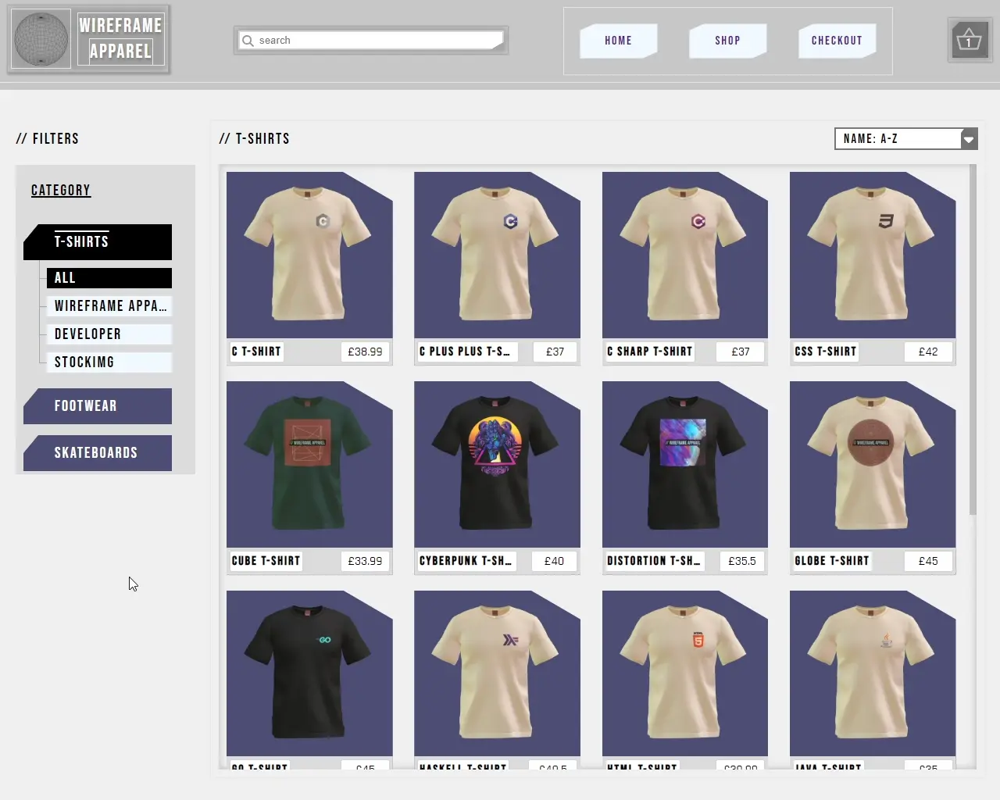

<a name="readme-top"></a>
<a href="#"></a>
# <a href="#"></a> Wireframe Apparel | <a href="https://mattxmade.github.io/wireframeapparel" target="_blank"> <strong>Live</strong></a>

> ### Repsonsive multi-page storefront

<br>

<div align="center">
  <a href="#"></a>

  <table>
    <tbody>
      <tr>
        <!--<td><a href="#"></a></td>-->
      </tr>
      <tr>
        <!--<td align=center><strong>Frontend Stack</strong></td>-->
        <td align="center">
          <a href="#"></a> 
          <a href="#"></a>   
          <a href="#"></a>
          <a href="#"></a>
          <a href="https://github.com/facebook/react"></a>
          <a href="#"></a>              </td>
      </tr>
    </tbody>
  </table> 
</div>

<br>

## About
The project is built in <a href="https://github.com/facebook/react"><strong>React</strong></a> using <a><strong>Functional Components</strong></a>. Navigation is handled using <a href="https://github.com/remix-run/react-router"><strong>React-Router</strong></a>. Component skeletons are created using <strong>JSX</strong> and <strong>Sass</strong> based on <a href="#planning">pre-production designs</a>. Layouts use Semantic HTML and are made responsive using a combination of <strong>CSS Flexbox</strong>, <strong>CSS Grid</strong> and media-queries.

State management and reactive logic is handled by built-in <strong>React Hooks</strong> such as <a href="https://react.dev/reference/react/useState">useState</a>, <a href="https://react.dev/reference/react/useRef">useRef</a> and <a href="https://react.dev/reference/react/useEffect">useEffect</a>.

<a href="https://github.com/pmndrs/react-three-fiber"><strong>React-Three-Fiber</strong></a> is used to render 3D models and create the product-page viewer. To improve performace, only one 3D model is used per product catergory. Design decals are then used to texture the model. 

## Features

<table>
  <thead>
  </thead>
  <tbody>
    <tr><td colspan=2></td></tr>
    <tr>
      <td align=center><strong>Product Catalog</strong></td>
      <td>Browse, search, sort and filter products</td>
    </tr>
    <tr><td colspan=2></td></tr>
    <tr>
      <td align=center><strong>Product Viewer</strong></td>
      <td>View items in 3D and customise them in realtime</td>
    </tr>
    <tr><td colspan=2></td></tr>
    <tr>
      <td align=center><strong>Dynamic Basket</strong></td>
      <td>Order tracking with ability to add, update and delete items</td>
    </tr>
  </tbody>
</table>

<br>

## Demo


<br>
<p align="right">(<a href="#readme-top">back to top</a>)</p>

## Overview
### Generating Products
Product data is derived from product image filenames. To streamline importing, product images are <a href="https://github.com/mattxmade/wireframeapparel/blob/main/src/assets/AssetsFromDirectory.js">mass imported</a> from their catergory directory and adhere to the following naming convention:

> #### Filename Schema
> ```js
> [name]_[brand]_[type]_[colour]_[style]_[tag].[ext]
> ```
>
> #### Filename Example
> ```js
>  "globe_wf_ts_wbc_fmbn_y.webp"
> ```

<br>

After <a href="https://github.com/mattxmade/wireframeapparel/blob/main/src/data/product.handlers.js">processing</a>, the above filename string would yield a JavaScript object with the following properties:

> #### T-shirt Product Item
> ```js
> {
>    index: 7,
>    id: "1oceKGeKwCAQzteb5i1Rf",
>    name: "globe",
>    brand: "Wireframe Apparel",
>    type: {
>        kind: "t-shirt",
>        category: "t-shirts"
>    },
>    price: 45,
>    style: "fmbn",
>    color: {
>        choice: "White",
>        options: [...],
>        initial: "White"
>    },
>    sizing: {
>        size: "unset",
>        chart: [ "XS", "S", "M", "L", "XL", "XL2", "XL3" ]
>    },
>    tag: true,
>    image: {
>        src: "/assets/catalog/tshirts/globe_wf_ts_wbc_fmbn_y.webp",
>        design: "/assets/designs/globe_wf.webp",
>        alt: "globe t-shirt"
>    }
> }
> ```

<br>

See <a href="https://github.com/mattxmade/wireframeapparel/blob/main/src/data/product.data.js#L14">product.data.js</a> for more information about how product items are created.

##

### Interacting with data
Several <a href="https://github.com/mattxmade/wireframeapparel/blob/main/src/data/product.data.js#L118">helper functions</a> are exposed to interact with the created product data. To simulate a Http request, function helpers are wrapped by timeouts and returned as Promises. As the project is now in production, timeout delays are set to 0.

> #### Product Data API
> #### Get
> ```js
>  const get = (id) => {
>    return new Promise((resolve) =>
>      setTimeout(() => resolve(_getProductById(id)), 0)
>    );
>  };
> ```
> #### List
> ```js
>  const list = (type, number) => {
>    return new Promise((resolve) =>
>      setTimeout(() => resolve(_getProductsByCategory(number, type)), 0)
>    );
>  };
>```
> #### Search
> ```js
>   const search = (queryString, number) => {
>    return new Promise((resolve) =>
>      setTimeout(() => resolve(_findProductByName(queryString)), 0)
>    );
>  };
> ```

<br>

Data is fecthed using the <a href="https://github.com/mattxmade/wireframeapparel/blob/main/src/data/fetchData.js">fetchData</a> helper function. It uses an aysnc/await, try/catch pattern.

> #### fetchData inside useEffect
> ```js
> // SearchPage.jsx
>
> {...}
>   useEffect(() => {
>    if (!location.search.length) navigate("/");
>
>    const query = location.search.slice(1, location.search.length - 1);
>
>    fetchData(ProductData.search, { setCache }, query);
>    props.handleSearchInput(query);
>  }, [location.search]);
> {...}
> ```

<br>
<p align="right">(<a href="#readme-top">back to top</a>)</p>

## Routing
### React-Router

> #### HashRouter | index.jsx
> ```js
> <React.StrictMode>
>  <HashRouter>
>    <App />
>    </HashRouter>
> </React.StrictMode>
> ```
>
> #### Route Example | App.jsx
> ```js
> <Routes>
>   {...}
>   <Route
>     path="/shop"
>     element={
>       <BrowsePage
>         clickThroughProductType={clickThroughProductType}
>         handleProductSelection={handleProductSelection}
>         handleLastPath={handleLastPath}
>      />
>    }
>  />
>  {...}
> </Routes>
> ```

<br>

Initially BrowserRouter was used for route navigation. However after deploying the application to GitHub Pages, 404s were encountered on all pages except for root when refreshing or navigating backwards.

Fortunately this isn't a bug and is expected behaviour as GitHub Pages only serves static pages. Switching to HashRouter solved the issue as GET requests to the server are sent from root - anything after the # symbol is then handled client-side.

###

> #### URL Comparison
>
> #### BrowserRouter URL
> ```js
> /shop
> ```
> #### HashRouter URL
> ```js
> /#/shop
> ```

<br>

A workaround to use BrowserRouter with GitHub Pages can be found <a href="https://github.com/rafgraph/spa-github-pages">here</a>.

<br>
<p align="right">(<a href="#readme-top">back to top</a>)</p>

## Layout Planning
Various e-commerce stores were visitied to get a feel for how they worked. After identifying common elements, rough layouts were drawn up. Visual references were useful in seperating design and implementation.

### Browse page


### Product page


<br>
<p align="right">(<a href="#readme-top">back to top</a>)</p>

## Components
### Building with React Three Fiber

#### Product Categories & 3D Models
There are currently three active product categories. Each product category has an equivalent Three.js ProductItem Component that renders its 3D model.  

> #### Active ProductItem Components
>
> <a href="https://github.com/mattxmade/wireframeapparel/blob/main/src/components/r3f/Trainers.jsx">Skateboard</a>
>
> <a href="https://github.com/mattxmade/wireframeapparel/blob/main/src/components/r3f/Skateboard.jsx">Trainers</a>
>
> <a href="https://github.com/mattxmade/wireframeapparel/blob/main/src/components/r3f/TShirt.jsx">TShirt</a>

#### 3D Models
A ProductItem is comprised of at least one mesh and one material.

A Product item's design image works as a material modifier, made possible by using the Decal Component provided by <a href="https://github.com/pmndrs/drei">@react-three/drei</a>

This allows the product design to occupy different positions on the 3D model.

###

> #### TShirt Component
> ```js
> /*
>  TShirt.js
>    ¬ simplified exctract
> */
>
><group {...props}>
>  <mesh geometry{nodes[tshirtMesh].geometry}>
>    <meshPhysicalMaterial
>      color={props.itemColor}
>      {...tshirtMaterialProps}
>      wireframe={props.wireframe}
>  />
>    <Decal {decals.tshirt.pocket} />
>    <Decal {...decals.tshirt.tag} />
>  </mesh>
>
>  <mesh {...} geometry={nodes[tagMesh].geometry}>
>    <meshPhysicalMaterial
>      color="#ffeeee"
>      map={productTag}
>      wireframe={props.wireframe}
>      {...tshirtMaterialProps}
>    />
>  </mesh>
></group>
> ```

#### Rendering
> ```jsx
> /*
>  ProductViewer.jsx
>    ¬ simplified extract
> */
> 
> <Canvas {...canvasProps}>
>   <Suspense fallback={<Loadscreen />}>
>     <PresentationControls {...}>
>       <ProductItem
>         wireframe={wireframe}
>         product={props.product}
>         itemColor={props.itemColor}
>       />
>       <Environment files={hdr}/>
>     </PresentationControls>
>    
>     <ItemViewerOverlay
>       rotateView={rotateView}
>       handleRotateView={handleRotateView}
>       handleWireframe={handleWireframe}
>     />
>   </Suspense>
> </Canvas>
> ```

### Subheading

#### Introduction
words here

#### Section 1

words here

#### Section 2

words here

###

> #### Code Heading
> ```js
> /*
>   [filename].[ext]
>     ¬ extract
> */
> ```

<br>

Full implementation <a href="#">@link</a>

<br>
<p align="right">(<a href="#readme-top">back to top</a>)</p>

## Roadmap
- [x] Build frontend UI
  - [x] Add product search, sorting and filtering
  - [x] Add Basket tracking (add, update, delete)
  - [x] Create browser/search pages
  - [x] Create product page with 3D viewer
  - [x] Create checkout page
  - [x] Create landing page

- [ ] Build backend infrastructure
  - [ ] Migrate project to fullstack framework
  - [ ] Create products database
  - [ ] Add API services

<br>
     
## Technologies
### Environment
<a href="#"></a>

### Build Tools
<a href="#"></a>
<a href="#"></a>

### Developer Tools
<a href="#"></a>
<a href="#"></a>
<a href="#"></a>

##

### Deployment
<a href="#"></a>

<p align="right">(<a href="#readme-top">back to top</a>)</p>
