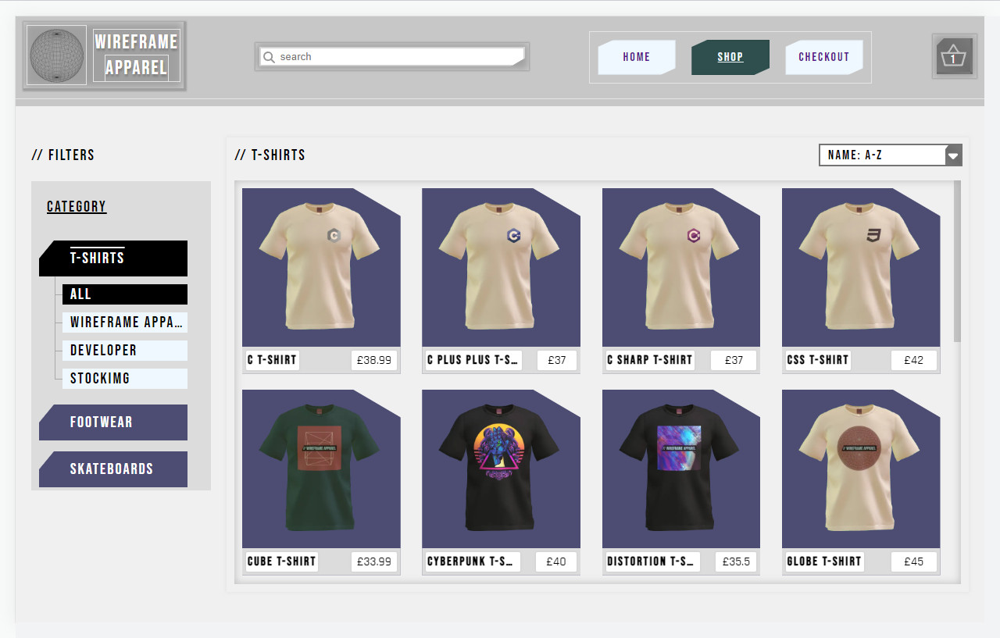

#  Shopping Cart | <a href="#" target="_blank"> <strong>Live</strong></a>

> ### E-commerce storefront

 

  
  
  ##
  
  
  
  
  

   

## Motivation
To build a React project that incorporates routing and to level-up my React test writing skills

## Tools
- React
- Webpack
- Jest

## Planning
 - Inventory storefront

 - Product page

